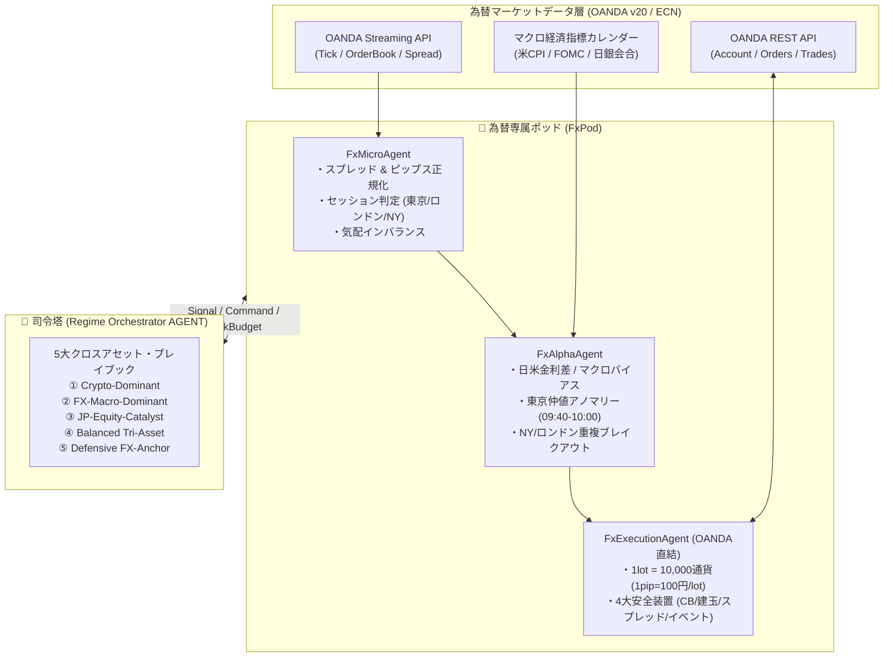

# FX専属ポッド (USD/JPY) ＆ Regime Orchestrator 拡張設計仕様書

> **文書番号**: SPEC-FX-20260918-002  
> **ステータス**: APPROVED / 実装設計完了  
> **改定日**: 2026年9月18日  
> **対象システム**: Antigravity Multi-Asset OS (BTC × 日本株 × FX)

---

## 1. FXポッド (USD/JPY) 追加のアーキテクチャ設計

### 1.1 目的
既存のBTC板マイクロ構造（HFT板不均衡・ミリ秒遅延補正・Fusion Engine）のコアロジックを破壊することなく、アセット抽象化レイヤーを通じて為替（USD/JPY・EUR/JPY）ラインを増設し、マルチアセット協調運用を実現する。



### 1.2 マーケット定義
* **Venue**: OANDA API (v20 / REST + Streaming)
* **Product**: USD/JPY スポット（標準1ロット = 10,000通貨、最小単位 0.1ロット=1,000通貨、1 pip = 0.01円 = 100円/lot）
* **Session**: 
  * 東京仲値 (09:40 - 10:00 JST, 09:55公示)
  * 東京セッション (09:00 - 15:00 JST)
  * ロンドンセッション (16:00 - 21:30 JST)
  * ロンドン/NY 重複セッション (21:30 - 01:00 JST - 最大流動性)
  * NY終盤 (01:00 - 06:00 JST)
  * オセアニア早朝 (06:00 - 09:00 JST - スプレッド拡大警戒)
  * 週末クローズ (土曜06:00 〜 月曜07:00 JST)

### 1.3 データインターフェース規格
BTCおよび日本株と同一フォーマットに正規化：
```python
{
    "timestamp": float,       # Unix Epoch (秒/ミリ秒)
    "symbol": "USDJPY",
    "bid_price": 155.250,
    "ask_price": 155.253,
    "spread_jpy": 0.003,      # 0.3 pips
    "spread_pips": 0.3,
    "bid_depth": 5.0,         # 万通貨
    "ask_depth": 3.0,
    "session": "TOKYO_FIX",
    "venue_id": "OANDA",
}
```

---

## 2. 「BTCミクロ → FXミクロ」Featureマッピング表

| カテゴリ | BTCミクロ特徴量 (既存) | FX (USD/JPY) 移植特徴量 | 変換・正規化ロジック (Scaling) |
| :--- | :--- | :--- | :--- |
| **価格単位** | 日本円 (1円刻み、呼値1円) | ピップス (1 pip = 0.01 JPY = 1銭) | `price_pips = price * 100.0` |
| **スプレッド** | 1,000円〜5,000円 (0.01〜0.04%) | 0.2〜0.5 pips (0.002〜0.003円) | スプレッドショック判定（平常時0.3pips、イベント時>3.0pipsで遮断） |
| **板不均衡** | `(Bid1 - Ask1) / (Bid1 + Ask1)` | `(BidDepth - AskDepth) / TotalDepth` | トップオブブックの厚みが安定しているため5レベル累積で計算 |
| **板圧力** | `Imbalance * (1 - SpreadPenalty)` | `Imbalance * (1 / (Spread_pips / BaselineSpread))` | スプレッドが平常比で拡大するほどシグナル強度を減衰 |
| **ボラティリティ** | 1分足絶対リターン (数十bp) | ペア別標準化 Z-Score リターン | `z_vol = (ret - mean_ret_session) / std_session` |
| **時間帯バイアス** | 24時間365日ほぼ一様 | セッション別パラメータ (`alpha_tokyo`, `alpha_ny`) | セッションフラグごとに閾値と利幅/損切幅を適応 |
| **フロー追従** | Taker成行約定方向 (Delta) | 仲値実需フロー ＋ ロンドン/NYブレイク | 仲値ウィンドウ(09:40-10:00)は実需ドル買いバイアス |

---

## 3. マクロイベント（CPI・FOMC・日銀）との連動テスト設計

### 3.1 イベントウィンドウ（Event Window）定義
* **Pre-Event (T-30m 〜 T-0m)**: ポジションサイズを通常時の **30%に縮小**、新規エントリー閾値を 0.65 ➔ **0.80 に引き上げ**。
* **On-Event (T-0m 〜 T+5m)**: スプレッド急拡大（スプレッドショック）を検知。スプレッド > 3.0 pips（0.03円）で新規発注を**完全遮断**。
* **Post-Event (T+5m 〜 T+30m)**: 指標発表結果（サプライズスコア）に応じたマクロバイアス（BULL_USD / BEAR_USD）を反映してモメンタム追従。

---

## 4. Regime Orchestrator 5大クロスアセット・プレイブック

| プレイブック名 | 主導アセット | 発動相場レジーム | BTC配分 | FX配分 | 日本株配分 | 主な動作ルール |
| :--- | :--- | :--- | :--- | :--- | :--- | :--- |
| **① Crypto-Dominant** | BTC/JPY | 高ボラ・リスクオン | **80〜100%** | 20〜30% | カタリストのみ | BTCのボラティリティ収益を最大化。FXは低ロット補助。 |
| **② FX-Macro-Dominant** | USD/JPY, EUR/JPY | CPI/FOMC/金利差 | 20〜40% | **70〜100%** | 縮小 | 為替マクロショックを捕捉。スプレッドガード連動。 |
| **③ JP-Equity-Catalyst** | 日本株6銘柄 | 東証開示/PTS急変 | 30〜50% | 20〜30% | **70〜100%** | TDnet/MIS・PTS因果AI主導。FXは仲値のみ。 |
| **④ Balanced Tri-Asset** | 3資産均等 | 平常・マクロ中立 | **40%** | **30%** | **30%** | ドローダウン平滑化・Sharpe最大化の安定運用。 |
| **⑤ Defensive FX-Anchor** | USD/JPY中心 | リスクオフ・急落 | **極小/停止** | **60〜100%** | 縮小 | 株式・暗号急落時にUSD安全資産化または円高トレンドを捕捉。 |

---

## 5. OANDA API 統合設計 (Streaming / REST / Risk Layer)

### 5.1 3レイヤー構造
1. **OandaStreaming**: 価格ストリーミング（SSE）、ミリ秒受信、切断時の指数バックオフ自動再接続。
2. **OandaREST**: 口座残高・建玉照会、成行/指値発注、約定取得。
3. **OandaRisk**: 
   * 建玉上限（USD/JPY: 最大3ロット、EUR/JPY: 最大2ロット）
   * スプレッドショック防止（スプレッド > 0.3円 / 30 pips で新規発注遮断）
   * 日次損失サーキットブレーカー（-15,000円到達でポッド単独自動停止）
   * イベント窓ロット縮小（通常ロットの30%上限）

---

## 6. 実装ロードマップ
1. [x] 設計ドキュメント策定 (`docs/fx_pod_usdjpy.md`)
2. [x] OANDAアダプターモジュール (`antigravity/multi_asset/pods/fx/oanda_adapter.py`)
3. [x] FX Execution Agent の OANDA REST / Risk統合 (`fx_execution_agent.py`)
4. [x] Regime Orchestrator の 5大プレイブック実装 (`regime_orchestrator.py`)
5. [x] 3資産協調テスト (`tests/test_multi_asset_os.py`) の実行・検証
