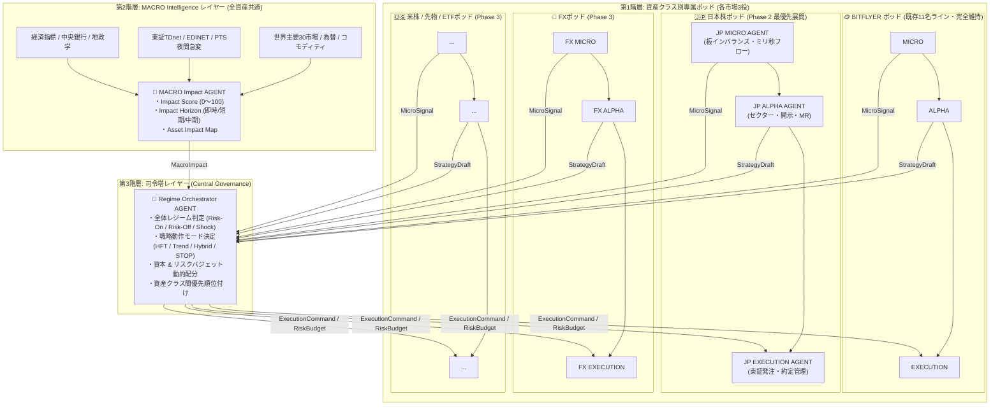

# 多資産クラス・インテリジェンスOS（AGENT体系）公式設計仕様書

> **文書番号**: SPEC-ARCH-20260918-001  
> **ステータス**: APPROVED / 正式採択  
> **改定日**: 2026年9月18日  
> **対象システム**: Antigravity / GapcorePJ 全資産クラス自動運用プラットフォーム  

---

## 1. 目的 & 策定背景

本仕様書は、現在 bitFlyer（BTC/JPY）で本番稼働中の既存11名体制の自律エージェント群を「絶対防衛コア（収益の核）」として完全に維持・保護しつつ、**日本株・FX・米株・先物・ETF** を含むグローバル多資産クラスへスケールアウトするための**「標準化されたAGENT構成・役割分担・3階層階層モデル」**を定義する。

### 核心原則（Core Principles）
1. **BITFLYERライン非破壊原則**: 既存のBTC/JPY専属11名体制（A1〜A11）は一切変更せず、短期収益の核として現状維持する。
2. **ポッド型アーキテクチャ（Pod Pattern）**: 他資産クラスは市場固有の「標準3役（MICRO / ALPHA / EXEC）」を1セットとしてプラグイン形式で追加可能にする。
3. **トップダウン・マクロ統括**: マクロショック（金利・地政学・開示）は全資産の上位レイヤーで一元集約し、各市場での判断の矛盾・衝突を物理的に排除する。
4. **資本・リスク予算管理（Risk Budgeting）**: 司令塔レイヤーが市場環境（レジーム）に応じて各ポッドへの許容損失枠（日次MDD枠・ポジション枠）を動的に配分する。

---

## 2. システム全体アーキテクチャ（3階層モデル）



---

## 3. 各階層エージェントの責任・仕様

### 第1階層：資産クラス別専属ポッド（各市場3役）
市場構造の違い（取引時間、板の深さ、呼値、手数料、APIプロトコル）をポッド内にカプセル化する。

#### ① MICRO担当 AGENT
* **役割**: 秒〜分単位の短期方向性・流動性レジームのリアルタイム推定
* **監視項目**:
  * 板インバランス（買い気配 vs 売り気配の厚み比率）
  * 約定フロー（Taker比率・アグレッサー方向）
  * スプレッド拡大/縮小・ミリ秒ボラティリティ
  * 大口注文（アイスバーグ・ステルス注文）の出現検知
  * 時間帯レジーム（東京・ロンドン・NY市場の開閉時間）
* **出力**: `MicroSignal`
  * `direction`: Long / Short / Neutral
  * `confidence`: 0 〜 100
  * `regime`: Trend / MeanReversion / HighVolatility / Illiquid

#### ② ALPHA分析 AGENT
* **役割**: 資産クラス固有のアルファ源（期待値の歪み）の自律探索・戦略設計
* **探索項目**:
  * トレンドフォロー / ミーンリバージョン / ボラティリティブレイクアウト
  * セクター連動 / ペアトレード（株式バスケット）
  * 時間帯別アノマリー（寄り付き、大引け、ロンドンフィックス）
* **出力**: `StrategyDraft`
  * 戦略Pythonコード（自動生成）
  * DRYRUNバックテスト指標（Sharpe, PF, WinRate, MDD, MaxConsecLoss）
  * 自己改善・修復案

#### ③ EXECUTION AGENT
* **役割**: リアルタイム売買執行・スリッページ最小化・厳格建玉防護
* **管理項目**:
  * スリッページ抑制・指値リフィル（在庫管理）
  * 司令塔からの動作モード（HFT / Trend / Hybrid / STOP）の厳格適用
  * ハードストップロス・目標利確・タイムアウト強制決済
  * 日次損失リミット（CB）・最大連敗数遮断（CB）
* **出力**:
  * 証券会社・取引所APIへの実発注シグナル
  * ポジション・損益テレメトリ・リスク遮断アラート

---

### 第2階層：MACROインテリジェンス（全資産共通上位レイヤー）
個別市場の枠を超えたグローバルマクロ・開示情報を一元解析する。

#### 🧠 MACRO Impact AGENT
* **役割**: ニュース・経済指標・法定開示・夜間取引から「市場を動かす力」を推定
* **分析対象**:
  * 経済指標（米CPI、雇用統計、GDP、FOMC、日銀政策決定会合）
  * 東証TDnet（決算短信、業績予想修正、大型M&A、不祥事）
  * 金融庁EDINET（大量保有報告書、内部統制報告書、有報）
  * PTS夜間急変（17:00〜23:59の異常値・出来高急増）
  * 世界の株価（主要30市場、日経平均、S&P500、NASDAQ、SOX半導体）
  * 為替（ドル円、ユーロドル）、コモディティ（原油、金、銅）、暗号資産（BTC）
* **出力**: `MacroImpact`
  * `impact_score`: 0 〜 100（市場影響度MIS）
  * `direction`: Risk-On / Risk-Off / Neutral
  * `horizon`: 即時（〜15分）/ 短期（当日）/ 中期（数日〜週）
  * `asset_impact_map`: 各資産クラス（BTC, 日本株, FX, 先物等）への影響度行列

---

### 第3階層：司令塔レイヤー（Regime Orchestrator）
システム全体の頭脳。ミクロとマクロの情報を統合し、全ポッドを統制する。

#### 🏰 Regime Orchestrator AGENT
* **役割**: 戦略モード決定・資本配分・全社的リスク調停
* **入力**:
  * 各資産ポッドからの `MicroSignal` および `StrategyDraft`
  * 第2階層からの `MacroImpact`
  * 全体の合算ドローダウン・流動性状態
* **主要機能**:
  1. **モード調停**:
     * 例: マクロが「CRITICALショック（MIS $\ge$ 85）」を発令した場合、ミクロがどんなに買いシグナルを出していても、該当ポッドのEXECUTIONに即時「STOP（新規エントリー停止＋建玉縮小）」を強制する。
  2. **リスクバジェット動的配分（Risk Budgeting）**:
     * 平常時: BTC 30% / 日本株 40% / FX 30%
     * 地政学ショック時: 現金（キャッシュ）80% / BTC 5% / 日本株 15%
  3. **戦略採択ガバナンス**:
     * ALPHAが起草した新戦略を、現在のマクロレジームに適合しているか審査・承認する。

---

## 4. 標準データ契約（Typed Data Schemas）

エージェント間通信のデータ契約を標準化する。

```python
from dataclasses import dataclass, field
from typing import Dict, List, Optional

@dataclass
class MicroSignal:
    asset_class: str          # "BTC", "JP_STOCK", "FX", "FUTURES"
    symbol: str               # "FX_BTC_JPY", "7203", "USDJPY"
    direction: str            # "LONG", "SHORT", "NEUTRAL"
    confidence: float         # 0.0 〜 100.0
    regime: str               # "TREND", "MEAN_REVERT", "HIGH_VOL", "ILLIQUID"
    spread_jpy: float
    imbalance_ratio: float    # 買い板 / 売り板 比率
    timestamp: float

@dataclass
class MacroImpact:
    impact_score: int         # 0 〜 100 (MIS)
    level: str                # "NORMAL", "WARNING", "CRITICAL", "WIDE"
    primary_event: str        # "米CPI上振れ", "トヨタ決算サプライズ"
    global_regime: str        # "RISK_ON", "RISK_OFF", "STAGFLATION"
    asset_impact_map: Dict[str, str] # {"JP_STOCK": "BULL", "FX": "BEAR_JPY", "BTC": "NEUTRAL"}
    horizon: str              # "IMMEDIATE", "INTRADAY", "SWING"
    timestamp: float

@dataclass
class ExecutionCommand:
    asset_class: str
    target_mode: str          # "HFT", "TREND", "HYBRID", "REDUCE_50", "STOP"
    allocated_risk_jpy: float # 許容日次損失リミット (円)
    max_position_size: float  # 最大ロット
    is_halted: bool           # サーキットブレーカー強制遮断フラグ
    reason: str
```

---

## 5. 資産クラス別ポッド配置 & 段階的展開計画

| フェーズ | 資産クラス | 対象銘柄 / 取引所 | 配置エージェント | ステータス |
| :--- | :--- | :--- | :--- | :---: |
| **Phase 1** | **暗号資産 (核)** | bitFlyer: FX_BTC_JPY | **既存11名ライン (完全固定)** | **🟢 本番稼働中** |
| **Phase 2** | **日本個別株** | 東証プライム/グロース (主要300銘柄) | JP MICRO / JP ALPHA / JP EXEC | **🚀 即時着手 (推奨)** |
| **Phase 3** | **為替 (FX)** | 各種FX業者: USD/JPY, EUR/JPY | FX MICRO / FX ALPHA / FX EXEC | ⏸️ 順次着手 |
| **Phase 4** | **株価指数先物** | 大阪取引所: 日経225先物, TOPIX先物 | FUTURES MICRO / ALPHA / EXEC | ⏸️ 順次着手 |
| **Phase 5** | **米国株 & ETF** | 米国市場: SPY, QQQ, NVDA 等 | US MICRO / ALPHA / EXEC | ⏸️ 順次着手 |

> **※ Phase 2（日本株ポッド）最優先の理由**:  
> 本日すでに東証適時開示（TDnet）、夜間PTS、開示因果AI、銘柄名寄せエンジンが完成・常駐しているため、最も低コストかつ高確度で収益化できる。

---

## 6. 運用ガバナンス原則

1. **BITFLYERライン変更の絶対禁止**:
   * 他資産の機能追加・改修時、`run_live.py` や `antigravity/` のBTC執行ロジックを直接触ることは固く禁止する。
2. **上位命令の絶対優先（Top-Down Precedence）**:
   * `Regime Orchestrator` の `STOP` コマンドは、各ポッドの `EXECUTION AGENT` のあらゆる独自判断に優先し、例外なく即座に新規発注を停止する。
3. **独立資金管理（Isolated Margin Principle）**:
   * 資産ポッド間の資金は厳格に隔離し、他資産のドローダウンが別資産の証拠金を毀損しない構造とする。
